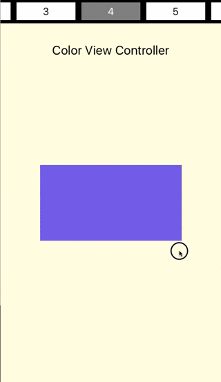

# LazyPages

[](https://travis-ci.org/WeltN24/LazyPages)
[](http://cocoapods.org/pods/LazyPages)
[](http://cocoapods.org/pods/LazyPages)
[](https://developer.apple.com/swift)
[](https://github.com/Carthage/Carthage)
[](http://cocoapods.org/pods/LazyPages)



**LazyPages** is a highly customizable library that helps you to show a scrollable list of view controllers synchronized with an index. It is written in `Swift 2.2` for `iOS 8+`. 

## Requirements

* iOS 8.0+
* Xcode 7.3+

## Features

- [x] Lazy load of view controllers, that allow us not to have all of them in memory when initialazing LazyPages. Furthermore, we can also initialise it with all the `UIViewController` instances or with closures that provides them.
- [x] View controllers are cached, and freed when memory is low.
- [x] View controllers can be instances of different subclasses of `UIViewController`.
- [x] Highly customizable, we can place the index and pages views as we wish, as well as desigining the index cells, with the help of Storyboard. Scroll directions could be set as wished.
- [x] Public API to go to a desired page.
- [x] Usage of `UIViewController`, not `UIView`.

## Usage

An instance of `LazyPages` can be created from the storyboard or just programmatically. 

To create it from the storyboard: 

* Add an instance of `UIViewController` to it. It will be the container of the Page Controller.
* Add two container views, one for the index and one for the page controller.
* Linked to these container views we have now two view controllers. In the desired index view controller set the class to `PageIndexCollectionViewController`, and in the PageController to `PageController`. Set their module to `LazyPages`.
* Inside the Index View Controller drag and drop an instance of `UICollectionView` and link it through an outlet to the `collectionView` property of the class. This collection view will represent the index; we will be able to customize the cells inside the Storyboard.

In the code of our view controller, we have to link both view controllers together and set the proper data source. We can do that in the `prepareForSegue` method:

```swift
override func prepareForSegue(segue: UIStoryboardSegue, sender: AnyObject?) {
    guard let identifier = segue.identifier else {
      return
    }
    
    guard let segueEnum = Segue(rawValue: identifier) else {
      return
    }
    
    switch segueEnum {
    case .PageController:
      guard let pageController = segue.destinationViewController as? PageController else {
        break
      }
      
      self.pageController = pageController
      pageController.dataSource = self
    case .PageIndex:
      guard let pageIndex = segue.destinationViewController as? PageIndexCollectionViewController else {
        break
      }
      
      self.pageIndex = pageIndex
      pageIndex.dataSource = self
    }
  }
```

If you want to implement it programmatically, you have to create and instance of `UICollectionView` and assign it to the property of `PageIndexCollectionViewController` as we explained in the storyboard case. As specified before we have to link them together in both cases:

```swift
pageController?.pageIndexController = self.pageIndex
pageIndex?.pageController = self.pageController
```

To populate the views, we assign the data source properties for both the index and the Page Controller. For the Page Controller we can implement the data source ourselves, or use the provided data source classes (`PageControllerArrayDataSource` and `PageControllerClosureDataSource`) that respectively require an array of `UIViewController` or closures. We can easily define a visual state for selection in the index view by overriding the `selected` property in the `UICollectionViewCell` subclass that we provide in the `PageIndexCollectionViewController` data source:

```swift
override var selected: Bool {
    didSet {
      if selected {
        backgroundColor = UIColor.grayColor()
      } else {
        backgroundColor = UIColor.whiteColor()
      }
    }
  }
```

##  Installation
### Carthage
To integrate LazyPages into your Xcode project using Carthage, specify it in your `Cartfile`:

```ogdl
github "WeltN24/LazyPages"
```

Run `carthage update` to build the framework and drag the built `LazyPages.framework` into your Xcode project.

### Manual Installation
 You can still add `LazyPages` as a submodule, drag and drop `LazyPages.xcodeproj` into your project, and embed `LazyPages.framework` in your target.

- Drag `LazyPages.xcodeproj` to your project
- Select your app target
- Click the + button on the Embedded binaries section
- Add `LazyPages.framework`

## License

LazyPages is available under the MIT license.

## Authors

LazyPages was made in-house by WeltN24

### Contributors

César Vargas Casaseca, cesar.vargas-casaseca@weltn24.de, [@toupper](https://github.com/toupper) on Github, [@VargasCasaseca](https://twitter.com/VargasCasaseca) on Twitter

Vittorio Monaco, vittorio.monaco@weltn24.de, [@vittoriom](https://github.com/vittoriom) on Github, [@Vittorio_Monaco](https://twitter.com/Vittorio_Monaco) on Twitter